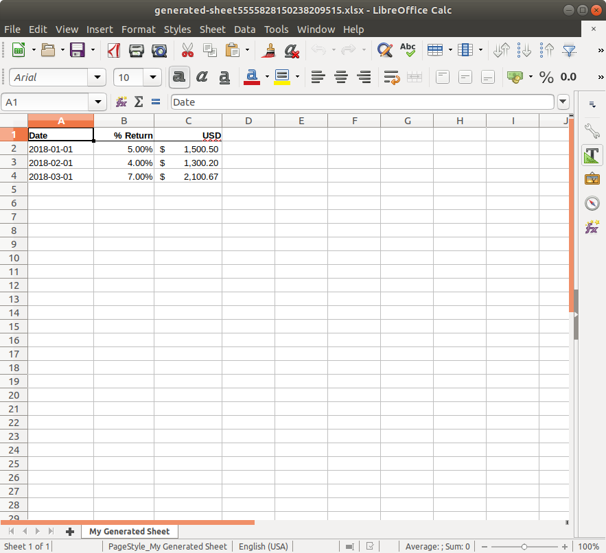
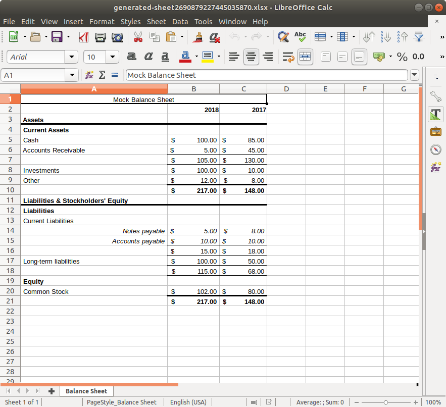
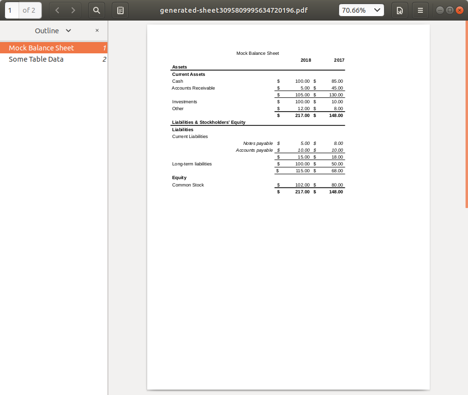
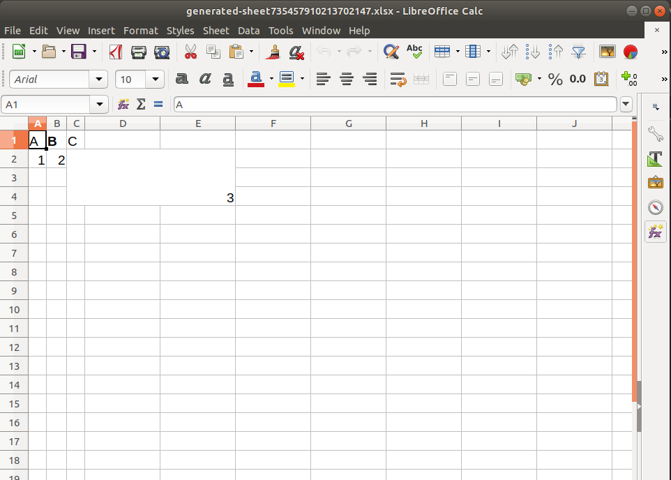
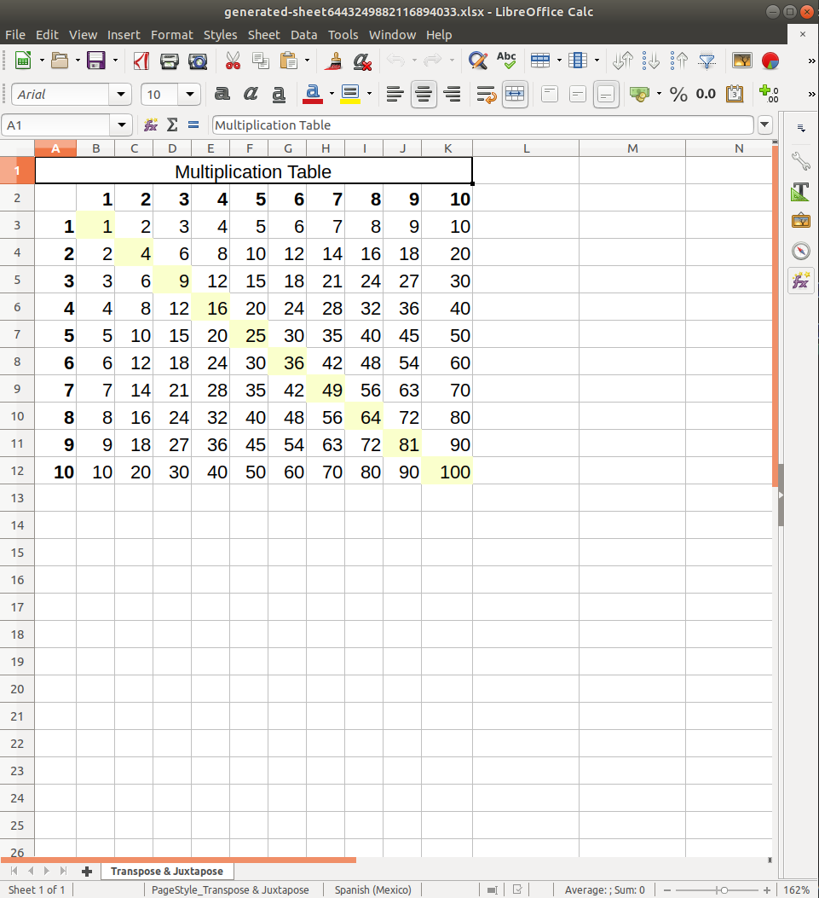

# excel-clj

Declarative generation of Excel documents & PDFs with Clojure from higher 
level abstractions (tree, table) or via a manual grid specification, with 
boilerplate-free common sense styling.

[CHANGELOG](CHANGELOG.md) | Uses [Break Versioning](https://github.com/ptaoussanis/encore/blob/master/BREAK-VERSIONING.md)

Lein:
```
[org.clojars.mjdowney/excel-clj "2.0.1"]
```

> Note: Ongoing v1.x support can be found on the 
[`version-1` branch](https://github.com/matthewdowney/excel-clj/tree/version-1).

- [Getting Started](#getting-started)
    - [Tables](#tables)
    - [Trees](#trees)
    - [PDF Generation](#pdf-generation)
    - [Style & Cell Merging](#style-&-cell-merging)
    - [What are the options for styling?](#what-are-the-options-for-styling?)
    - [Grids](#grids)
    - [Templates](#templates)
- [Roadmap](#roadmap)

## Getting Started

All of the namespaces have a `comment` form at the end (as well as throughout) 
with example usage; they're intended to be browsable and easy to interact with 
to glean information beyond what's here in a the readme.

You can use this library at two levels. For a low level, `Writer`-style 
interface, see [poi.clj](src/excel_clj/poi.clj) and the accompanying `comment`
forms. For high level usage, read on!

Start by skimming this and then browsing [core.clj](src/excel_clj/core.clj).

### Tables
Though Excel is much more than a program for designing tabular layouts, a table
is a common abstraction imposed on Excel data.

```clojure
(require '[excel-clj.core :as excel])

(def table-data
  [{"Date" #inst"2018-01-01" "% Return" 0.05M "USD" 1500.5005M}
   {"Date" #inst"2018-02-01" "% Return" 0.04M "USD" 1300.20M}
   {"Date" #inst"2018-03-01" "% Return" 0.07M "USD" 2100.66666666M}])

(let [;; A workbook is any [key value] seq of [sheet-name, sheet-grid].
      ;; Convert the table to a grid with the table-grid function.
      workbook {"My Generated Sheet" (excel/table-grid table-data)}]
  (excel/quick-open! workbook))
```



> Note: The examples here use `quick-open!` to ... quickly open the workbook. 
  You would use `write!` to write to some location on disk, or `write-stream!` 
  for writing elsewhere.

### Trees

Sometimes — frequently for accounting documents — we use spreadsheets to sum 
categories of numbers which are themselves broken down into subcategories.

For example, a balance sheet shows a company's assets & liabilities by summing
the balances corresponding to an account hierarchy.

```clojure
(def assets
  {"Current Assets" {"Cash"                {2018 100M, 2017 85M}
                     "Accounts Receivable" {2018 5M, 2017 45M}}
   "Investments"    {2018 100M, 2017 10M}
   "Other"          {2018 12M, 2017 8M}})

(def liabilities
  {"Liabilities"
   {"Current Liabilities"
    {"Notes payable"    {2018 5M, 2017 8M}
     "Accounts payable" {2018 10M, 2017 10M}}
    "Long-term liabilities"
    {2018 100M, 2017 50M}}
   "Equity"
   {"Common Stock" {2018 102M, 2017 80M}}})
```

We might choose to e.g. treat each one as a tree and stack them vertically, with 
a title at the top:

```clojure
(let [assets (tree-grid {"Assets" assets})
      lbs (tree-grid {"Liabilities & Stockholders' Equity" liabilities})
      remove-headers rest]
  (quick-open!
    {"Balance Sheet"
     (with-title "Mock Balance Sheet"
       (concat assets (remove-headers lbs)))}))
```



Trees are pretty flexible — browse the [tree.clj](src/excel_clj/tree.clj) 
namespace for more examples of things to do with them. 

In my own usage of this library I frequently find myself manipulating trees of 
accounting data using `tree/fold` and then stacking together trees to 
demonstrate addition, subtraction, and multiplication (e.g. for exchange rates) 
of different subsets of data, culminating in one "bottom line" tree that 
contains final result of those calculations.


### PDF Generation

If you're on a system that uses a LibreOffice or Apache OpenOffice implementation of Excel, PDF 
generation works the same was as creating a spreadsheet:

```clojure
(excel/quick-open-pdf!
  {"Mock Balance Sheet" (excel/tree-grid tree/mock-balance-sheet) 
   "Some Table Data" (excel/table-grid table-data)})
```



### Style & Cell Merging

Each workbook is a map: `{sheet-name [[cell]]}`. Each `cell` is either
  1. A plain value, e.g. `"abc"`, `#inst"2020-01-01"`, `110.5M`, `0.0001`; or
  2. An embellished value, including style and dimension data, eg:
     ```clojure
     (require '[excel-clj.cell :as cell])

     (def cell
       (let [header-style {:border-bottom :thin :font {:bold true}}]
         (-> "Header"
             (cell/style header-style)
             (cell/dims {:height 2})
             (cell/style {:vertical-alignment :center}))))

     (clojure.pprint/pprint cell)
     ; #:excel{:wrapped? true,
     ;         :data "Header",
     ;         :style
     ;         {:border-bottom :thin,
     ;          :font {:bold true},
     ;          :vertical-alignment :center},
     ;         :dims {:width 1, :height 2}}

So you could e.g. write an (ugly) grid with:
```clojure
(let [grid [["A" (cell/style "B" {:font {:bold true}}) "C"]
            [1 2 (cell/dims 3 {:width 3 :height 3})]]]
  (excel/quick-open! {"Sheet 1" grid}))
```



### What are the options for styling?

The code in this library wraps [Apache POI](https://poi.apache.org/). For 
styling, the relevant POI object is [CellStyle](https://poi.apache.org/apidocs/dev/org/apache/poi/ss/usermodel/CellStyle.html).

In order to insulate code from Java objects, style specification is done via 
maps, for instance the style to highlight a cell would be:
```clojure 
{:fill-pattern :solid-foreground
 :fill-foreground-color :yellow}
```

Under the hood however, all of the key/value pairs in the style maps correspond 
directly to setters within the POI objects. So if you browse the CellStyle 
documentation, you'll see `CellStyle::setFillPattern` and 
`CellStyle::setFillForegroundColor` methods. 

The map attributes are camel cased to find the appropriate setters, and the 
corresponding values are run through the multimethod 
[excel-clj.style/coerce-to-obj](src/excel_clj/style.clj) which dispatches on the
attribute name and returns some value that's appropriate to hand to POI.

If you're interested in greater detail, see the namespace documentation for 
[style.clj](src/excel_clj/style.clj), otherwise it's sufficient to know that enums are keyword-ized and
colors are either given as keywords (`:yellow`) or as RGB three-tuples 
(`[255 255 255]`).
  
### Grids

Both `tree-grid` and `table-grid` create `[[cell]]` data structures with 
default styling and positioning for the cells. 

You can use the `transpose` and `juxtapose` helpers along with the `cell` 
namespace to manipulate grids more manually.

For example, a multiplication table with all of the squares highlighted:

```clojure
(let [highlight {:fill-pattern :solid-foreground
                 :fill-foreground-color :yellow}

      grid (for [x (range 1 11)]
             (for [y (range 1 11)]
               (cond-> (* x y) (= x y) (cell/style highlight))))

      cols (map #(cell/style % {:font {:bold true}}) (range 1 11))
      ;; Add the top column labels
      grid (concat [cols] grid)
      ;; Add the left-hand column labels
      grid (excel/juxtapose (excel/transpose [(cons nil cols)]) grid)]
  (excel/quick-open!
    {"Transpose & Juxtapose"
     (excel/with-title "Multiplication Table" grid)}))
```



### Templates

The support for templates is not feature packed, but it works well in situations 
where your template can use formulas to read data from another sheet.

The `append!` function allows merging in a sheet to a workbook, replacing any 
other sheet of the same name. So, if your template is a workbook with a main 
sheet that reads from another data sheet, you can fill in the template by 
replacing the data sheet.

For example, you can try:
```clojure
(def example-template-data
  ;; Some mocked tabular uptime data to inject into the template
  (let [start-ts (inst-ms #inst"2020-05-01")
        one-hour (* 1000 60 60)]
    (for [i (range 99)]
      {"Date"                 (java.util.Date. (+ start-ts (* i one-hour)))
       "Webserver Uptime"     (- 1.0 (rand 0.25))
       "REST API Uptime"      (- 1.0 (rand 0.25))
       "WebSocket API Uptime" (- 1.0 (rand 0.25))})))


; The template here has a 'raw' sheet, which contains uptime data for 3 time
; series, and a 'Summary' sheet, wich uses formulas + the raw data to compute
; and plot. We're going to overwrite the 'raw' sheet to fill in the template.
(let [template (clojure.java.io/resource "uptime-template.xlsx")
      new-data {"raw" (excel/table-grid example-template-data)}]
  (excel/append! new-data template "filled-in-template.xlsx"))
```

## Roadmap

- A way to read in a saved workbook to the `{sheet-name [[cell]]}` format. I'm 
  not sure what the best way to extract style data is, since there are so many
  possible values.
